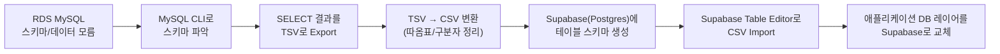
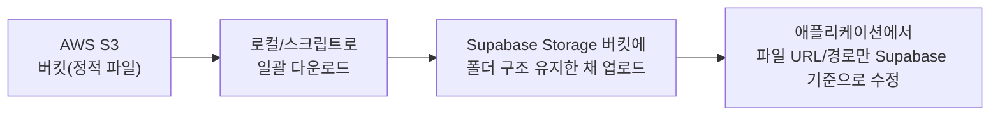
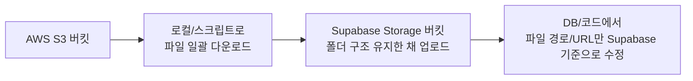
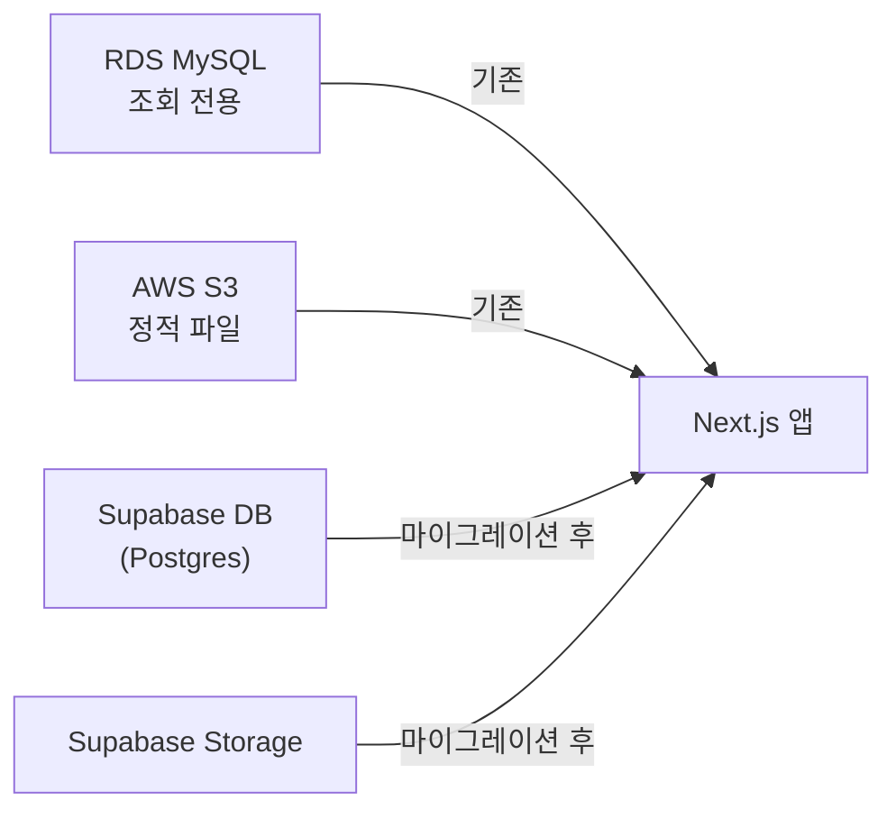

# 승룡이네집 AWS → Supabase 마이그레이션 가이드

_RDS(MySQL) + S3 Storage를 “읽기 전용”으로 쓰던 서비스를 Supabase로 옮긴 실제 사례 정리_

> 이 문서는 **기존 스키마를 모를 때 RDS에서 스키마/데이터를 꺼내 Supabase로 옮기는 전체 과정**을 정리한 가이드입니다.  
> 특히 `SELECT ... INTO OUTFILE` 권한이 막힌 상황에서 **MySQL CLI + (선택적으로) S3를 이용해 TSV로 내보내는 패턴**을 포함합니다.
>
> 예시 프로젝트에서는 DB와 S3 Storage가 **단순 Read 용도(조회 전용)** 로만 쓰이고 있었기 때문에,
>
> - **RDS(MySQL)**: 책/위치 정보 등 컨텐츠 메타데이터 읽기 전용
> - **S3**: 이미지 등의 정적 파일 읽기 전용  
>   이라는 전제 하에서, **다운타임 없이 한 번에 덤프 → Import** 하는 전략을 썼습니다.
>
> 비슷한 상황이라면 예를 들어:
>
> - RDS + S3 조합을 하나의 관리형 서비스(Supabase)로 단순화하고 싶거나
> - 저렴한 개발·운영 비용, 쉬운 콘솔/권한 관리가 필요하거나
> - 별도 백엔드 서버 없이도 DB/Storage를 바로 붙여 쓰고 싶은 경우  
>
> 에 이 글의 흐름을 거의 그대로 가져다가 쓸 수 있습니다.

---

## 0. 전체 흐름 한눈에 보기

먼저 “어떤 순서로 뭘 할 건지”를 큰 그림으로 정리해봅시다.



S3 Storage는 별도지만, 패턴은 비슷합니다.



이제 각 단계를 조금 더 구체적으로 들어가 보겠습니다.

---

## 1. RDS(MySQL) 스키마를 모를 때: CLI로 “실제” 구조 파악하기

마이그레이션을 제대로 하려면 **먼저 현재 스키마를 정확히 알아야** 합니다.
AWS 콘솔에 나오는 정보만 보고는 세부 타입이나 제약 조건을 알 수 없기 때문에,
MySQL CLI로 직접 붙어 **`SHOW CREATE TABLE` 기준으로 보는 것**이 가장 확실합니다.

### 1-1. RDS 접속 정보 확인

1. **AWS 콘솔 → RDS → DB 인스턴스 선택**
2. **엔드포인트, 포트, DB 이름, 유저 이름**을 확인
    - 예:
        - 엔드포인트: `seongryoung-books-250306.cdwkg2iiyx5i.ap-northeast-2.rds.amazonaws.com`
        - 포트: `3306`
        - DB 이름: `seongryoung`
        - 유저: `admin`

### 1-2. 로컬에서 MySQL CLI로 접속

```bash
mysql -h seongryoung-books-250306.cdwkg2iiyx5i.ap-northeast-2.rds.amazonaws.com \
      -P 3306 \
      -u admin \
      -p
```

- 비밀번호 입력 후 접속에 성공하면, 프롬프트가 `mysql>` 로 바뀝니다.

### 1-3. 데이터베이스/테이블/스키마 조회

```sql
-- 1) 사용 가능한 데이터베이스 목록
SHOW DATABASES;

-- 2) 사용할 데이터베이스 선택
USE seongryoung;

-- 3) 테이블 목록 확인
SHOW TABLES;

-- 4) 특정 테이블 스키마 확인
SHOW CREATE TABLE books\G
```

`SHOW CREATE TABLE books\G` 결과를 통해:

- 컬럼 이름 / 타입
- PRIMARY KEY, AUTO_INCREMENT
- DEFAULT 값
- 인덱스, 제약 조건

까지 한 번에 확인할 수 있습니다.

이 정보를 기반으로 **Postgres에서 어떤 타입/제약으로 설계할지**를 결정하면 됩니다.
(MySQL `int(11)` ⇔ Postgres `integer`, `tinyint(1)` ⇔ `boolean` 등 매핑만 조심하면 됩니다.)

---

## 2. 데이터를 TSV로 Export하는 두 가지 패턴

스키마를 파악했으면 이제 **실제 데이터**를 꺼낼 차례입니다.
여기서 가장 먼저 떠오르는 건 `SELECT ... INTO OUTFILE` 인데, RDS 환경에서는 대개 권한이 막혀 있습니다.

그래서 이 글에서는:

- **권한이 열려 있는 단순한 환경**과
- **RDS에서 FILE 권한이 막힌 환경**

을 나누어 정리합니다.

### 2-1. 단순 환경 (권한 허용): MySQL에서 바로 TSV 내보내기

권한이 허용된 환경이라면, MySQL 안에서 바로 TSV를 만들 수 있습니다.

```sql
USE seongryoung;

SELECT
  id,
  title,
  season,
  total_num,
  composition,
  author,
  publisher,
  comment,
  location
FROM books
INTO OUTFILE '/tmp/books.tsv'
FIELDS TERMINATED BY '\t'
ENCLOSED BY ''
LINES TERMINATED BY '\n';
```

그 후, MySQL이 설치된 서버(예: EC2, 로컬 머신)에서 `/tmp/books.tsv` 파일을 꺼내 Supabase 마이그레이션에 사용하면 됩니다.

> **주의: RDS 인스턴스에 직접 파일을 쓸 수 있는 환경은 거의 없다**
> 일반적인 RDS에서는 이 방식이 막혀 있는 경우가 많습니다.
> 이 글의 핵심은 **“그럴 때 어떻게 우회해서 TSV를 얻느냐”** 입니다.

### 2-2. RDS에서 FILE 권한이 막힌 경우: MySQL CLI + (옵션) S3를 이용한 TSV Export

일반적인 RDS MySQL에서는 `SELECT ... INTO OUTFILE` 이 막혀 있거나,
Aurora/RDS S3 연동이 아닌 이상 직접 로컬 파일을 쓸 수 없는 경우가 많습니다.

이럴 때 사용할 수 있는 전략은 크게 두 가지입니다.

#### 방법 A: MySQL 클라이언트에서 표준출력을 TSV로 저장 (권장)

**가장 단순하고 어디서나 통하는 방법**입니다.
로컬에서 RDS에 접속하면서, 결과를 파일로 리디렉션합니다.

```bash
mysql -h seongryoung-books-250306.cdwkg2iiyx5i.ap-northeast-2.rds.amazonaws.com \
      -P 3306 \
      -u admin \
      -p \
      --default-character-set=utf8mb4 \
      --skip-column-names \
      --batch \
      -e "SELECT id, title, season, total_num, composition, author, publisher, comment, location FROM seongryoung.books" \
      > books.tsv
```

- `--batch --skip-column-names` 옵션을 사용하면:
    - 컬럼 헤더 없이
    - 각 행이 탭 구분 TSV 형태로 출력됩니다.

이렇게 생성된 `books.tsv` 파일을 곧바로 Supabase로 가져갈 수 있습니다.

> **인코딩 주의**
> 한글/이모지 데이터가 있다면 `--default-character-set=utf8mb4` 를 꼭 붙여주세요.
> 붙이지 않으면 깨진 문자(�)가 Supabase까지 전파됩니다.

#### 방법 B: RDS → S3 통합 기능이 가능한 경우 (Aurora 전용 패턴)

Aurora MySQL 또는 S3 통합이 가능한 RDS MySQL의 경우,
RDS에서 직접 S3로 TSV를 떠서, 이후 AWS CLI로 가져오는 방식도 가능합니다.

1. RDS에서 S3로 쓰기 권한이 있는 IAM Role을 연결
2. MySQL에서 S3로 직접 TSV를 생성:

```sql
SELECT
  id,
  title,
  season,
  total_num,
  composition,
  author,
  publisher,
  comment,
  location
INTO OUTFILE S3 's3-bucket-name/path/books.tsv'
FIELDS TERMINATED BY '\t'
LINES TERMINATED BY '\n';
```

3. 이후 로컬에서 AWS CLI로 S3에서 TSV를 다운로드:

```bash
aws s3 cp s3://s3-bucket-name/path/books.tsv ./books.tsv
```

> 이 방식은 **RDS ↔ S3 통합이 활성화된 환경**에서만 동작합니다.
> 일반적인 RDS MySQL에서는 방법 A(표준출력 리디렉션) 또는 로컬/EC2에서 `mysqldump` 를 사용하는 편이 더 보편적입니다.

---

## 3. TSV → CSV 변환 (Supabase Import를 위한 전처리)

Supabase의 Table Editor는 CSV Import를 공식 지원합니다.
특히 필드 안에 콤마가 있을 때를 대비해 **모든 필드를 따옴표로 감싸는 형태**가 가장 안전합니다.

### 3-1. Python 원라이너로 TSV → CSV 변환

```bash
python3 -c "import csv, sys; reader = csv.reader(sys.stdin, delimiter='\t'); writer = csv.writer(sys.stdout, quoting=csv.QUOTE_ALL); writer.writerows(reader)" < books.tsv > books_fixed.csv
```

- 입력: `books.tsv` (탭 구분)
- 출력: `books_fixed.csv` (콤마 구분 + 모든 필드 따옴표)

이제 `books_fixed.csv` 를 Supabase Table Editor에서 Import 할 수 있습니다.

> **소규모 데이터라면?**
> 행 수가 아주 적다면(수십 개 수준) Excel / Numbers로 열고 CSV로 다시 저장해도 됩니다.
> 다만 이 경우 자동 형식 추론(날짜, 숫자 등) 때문에 의도치 않은 타입 변환이 들어갈 수 있어,
> **정확도가 중요한 마이그레이션에는 위 Python 원라이너처럼 “기계적인 변환”을 추천합니다.**

---

## 4. Supabase(Postgres) 테이블 생성 및 Import

이제 Supabase에서 Postgres 스키마를 만들고, 방금 만든 CSV를 넣을 차례입니다.

### 4-1. Postgres 스키마 생성

아래 예시는 이 글에서 사용한 `books` 테이블의 스키마입니다.  
**실제 서비스에서는 `SHOW CREATE TABLE ...` 결과를 기반으로**, 각자 테이블 구조에 맞게 컬럼/타입/제약 조건을 조정해 주세요.  
중요한 것은 “MySQL에서 쓰이던 의미를 최대한 그대로 보존한 채 Postgres 타입으로 옮긴다”는 원칙입니다.

Supabase SQL Editor에서:

```sql
create table public.books (
  id integer generated by default as identity primary key,
  title varchar(100) not null,
  season varchar(30),
  total_num smallint not null,
  composition varchar(100) not null,
  author varchar(30),
  publisher varchar(30),
  comment varchar(100),
  location integer not null
);
```

> `generated by default as identity` 를 사용해야, CSV Import 시 기존 `id` 값을 직접 넣을 수 있습니다.
> `generated always` 로 되어 있으면 Import 시 `id` 컬럼에 값을 넣을 수 없어서 에러가 납니다.

이미 `GENERATED ALWAYS` 로 만든 경우에는:

```sql
alter table public.books
  alter column id
  set generated by default;
```

로 한 번만 수정해 줍니다.

> **타입 매핑 팁**
>
> - MySQL `INT` → Postgres `integer`
> - MySQL `TINYINT(1)` → Postgres `boolean` (또는 `smallint`)
> - MySQL `VARCHAR(n)` → Postgres `varchar(n)`
>   대략 이 정도만 지켜도 대부분의 단순 조회용 테이블은 무리 없이 옮길 수 있습니다.

### 4-2. Table Editor에서 CSV Import

1. Supabase 콘솔 → Table Editor → `books` 테이블
2. 상단 `Import data` → `books_fixed.csv` 선택
3. 컬럼 매핑 확인:
    - `id, title, season, total_num, composition, author, publisher, comment, location`
4. Import 실행

### 4-3. 데이터 검증

Supabase SQL Editor:

```sql
select count(*) from public.books;

select * from public.books
order by id
limit 5;
```

대표적인 몇 행이 RDS에서 보던 데이터와 동일하면 Import 성공입니다.
(행 개수와 대표 레코드 몇 개만 맞춰봐도 1차 검증은 충분합니다.)

---

## 5. S3 → Supabase Storage 마이그레이션 (요약)

이 프로젝트에서는 DB뿐만 아니라 **이미지 같은 정적 파일도 S3에만 Read-Only**로 존재했습니다.
Supabase Storage로 옮길 때는 다음과 같은 패턴을 썼습니다.



1. **S3에서 파일 목록/경로 조회**
    - `aws s3 ls s3://my-bucket/path/ --recursive` 로 전체 파일 나열
2. **로컬 혹은 임시 서버로 일괄 다운로드**
    - `aws s3 sync s3://my-bucket/path ./downloads` 패턴
3. **Supabase Storage CLI/콘솔/SDK로 업로드**
    - 버킷을 하나 만들고, 될 수 있으면 **기존 경로 구조를 그대로 유지**해서 업로드
4. **DB 혹은 코드에서 경로만 치환**
    - 예: 기존 `https://{s3-domain}/path/xxx.jpg` → `https://{supabase-project}.supabase.co/storage/v1/object/public/{bucket}/path/xxx.jpg`

이 글에서는 코드 구현보다는 **마이그레이션 흐름** 위주로 다루기 때문에,
구체적인 Upload 스크립트는 생략하지만, 큰 틀은 위와 같습니다.

---

## 6. 애플리케이션과 Supabase 연동 (이 프로젝트 구조 기준 요약)

이제 데이터와 파일을 다 옮겼으니, 애플리케이션 코드에서 **데이터 소스만 RDS → Supabase로 바꾸면** 됩니다.
프로젝트 구조는 각자 다르겠지만, 일반적으로는 다음과 같은 순서로 작업하면 됩니다.

1. 기존 MySQL 쿼리/ORM 레이어를 찾는다.  
   - 예: `SELECT ... FROM books` 와 같은 SQL, 혹은 해당 테이블을 읽는 리포지토리/서비스 함수들
2. 같은 책임을 가지는 **Supabase SDK 호출**로 치환한다.
3. 타입 시스템(TypeScript 등)을 쓰고 있다면, 엔티티 타입(`Book` 등)은 그대로 두고 **데이터 소스만 바뀌도록** 유지한다.

예를 들어 Next.js + TypeScript 환경이라면, 기존에 이렇게 직접 MySQL을 조회하던 코드를:

```ts
// before (예시)
const rows = await queryDatabase<Book>("SELECT * FROM books WHERE title LIKE ?", [
  `%${keyword}%`,
]);
```

다음과 같이 Supabase SDK 호출로 교체할 수 있습니다.

```ts
// after (예시)
const { data: rows, error } = await supabase
  .from("books")
  .select("*")
  .ilike("title", `%${keyword}%`);
```

핵심은 “애플리케이션 입장에서는 여전히 `Book[]` 을 받는다”는 계약을 유지하는 것입니다.  
이렇게 하면 나머지 UI/비즈니스 로직은 크게 건드리지 않고, **DB 백엔드만 MySQL → Supabase(Postgres)** 로 교체할 수 있습니다.



이렇게 하면, **기존 RDS 스키마를 모르는 상태에서도**:

1. MySQL CLI로 스키마를 확인하고,
2. TSV/CSV로 데이터를 Export,
3. Supabase에 스키마를 재구성하고 데이터를 Import,
4. S3 파일을 Supabase Storage로 옮기고,
5. 애플리케이션의 DB/Storage 접근 레이어를 Supabase로 전환

까지의 전체 흐름을 재현할 수 있습니다.

---

## 7. 정리

이 글에서 다룬 마이그레이션의 핵심을 다시 정리하면:

1. **스키마를 모르면 먼저 CLI로 “실제 스키마”부터 본다.**
   `SHOW CREATE TABLE` 기준으로 보는 것이 가장 정확하다.
2. **RDS(MySQL)에서 `SELECT ... INTO OUTFILE` 이 막혀 있다면 MySQL CLI 표준출력 리디렉션으로 TSV를 뽑는다.**
   Aurora + S3 통합이 있다면 S3 OUTFILE도 고려할 수 있다.
3. **Supabase Import를 위해 TSV → CSV 변환 시, 따옴표/구분자를 명시적으로 다루는 것이 안전하다.**
   Python 원라이너로 “기계적인 변환”을 추천.
4. **Postgres 스키마 생성 시 `generated by default as identity` 로 설정해 기존 id 값을 그대로 이식한다.**
5. **S3 → Supabase Storage는 “경로 유지 + URL만 치환” 패턴으로 옮기면 애플리케이션 수정 범위를 최소화할 수 있다.**

이 패턴은 단순 조회만 하는 소규모 서비스는 물론,
“낡은 RDS + S3를 Supabase로 슬쩍 갈아끼우고 싶은” 사이드 프로젝트에도 그대로 재활용할 수 있습니다.
