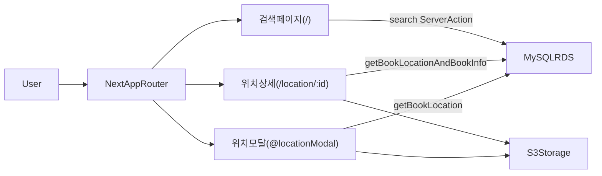
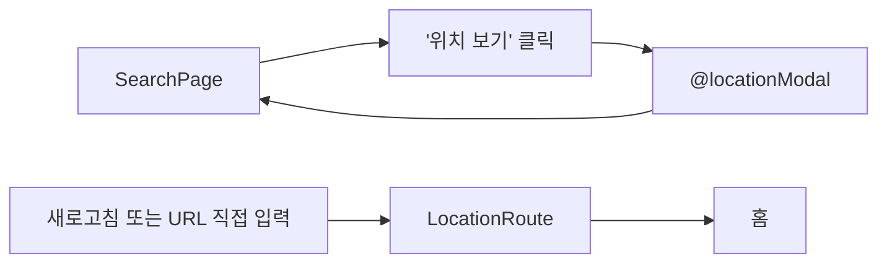

## License

이 프로젝트는 NonCommercial License에 따라 배포됩니다. 비상업적 용도로만 사용 가능합니다.

---

## 프로젝트 개요

> **승룡이네집 도서 검색 시스템 – 만화카페 책 위치를 바로 찾는 검색 서비스**  
> 강동구 강풀만화거리(승룡이네집)에 있는 만화책들의 위치를, 검색 한 번으로 바로 찾을 수 있는 웹 서비스입니다.

- **문제**: 수백 권의 만화책이 있지만, 원하는 책의 **위치(책장 번호)** 를 한 번에 알 수 있는 시스템이 없었습니다.
- **해결**: 책 제목 일부만 입력해도 도서를 검색하고, **책장 조감도 이미지와 함께 실제 위치**를 안내하는 검색 시스템을 구축했습니다.

---

# 승룡이네집 도서 검색 시스템


## 1. 배포 URL

[승룡이네집 도서 검색 시스템](https://seongryung.vercel.app/)


## 기술 스택 요약

- **Framework**: Next.js 15 (App Router)
- **Language**: TypeScript
- **UI**: Tailwind CSS, 커스텀 컬러 테마, `lucide-react`
- **Data & Backend**: AWS RDS(MySQL, `mysql2/promise`), Server Actions(`cache`) 기반 조회, SQL 파라미터 바인딩
- **Infra & 기타**: AWS S3(도서/책장 이미지), Vercel 배포, `@vercel/analytics`, `@vercel/speed-insights`

## 주요 기능 요약

- **제목 기반 도서 검색**: 검색어 일부만 입력해도 제목에 해당 문자열이 포함된 도서를 조회하고, 결과는 `/?query=검색어` 형태의 URL Query로 유지됩니다.
- **검색 맥락 유지**: 새로고침하거나 URL을 공유해도 같은 검색 결과를 다시 볼 수 있도록, 검색 상태를 `useState`가 아닌 URL Query로 관리했습니다.
- **책장 위치 안내**: 검색 결과 카드에서 **위치 보기**를 누르면 Parallel/Intercepting Route 기반 모달로 책장 위치 이미지를 표시하거나, 직접 URL 접근 시에는 별도의 상세 페이지에서 책 정보와 위치를 함께 보여줍니다.
- **UX 개선**: Skeleton 로딩, 이미지 lazy loading, layout shift 방지 박스, 반응형 레이아웃, 배경 스크롤 잠금 등으로 실제 공간에서 모바일로 접근하는 사용성을 고려했습니다.
- **SEO 최적화**: 검색어·도서별 `generateMetadata`와 Open Graph, favicon/OG 이미지 설정을 통해 검색 엔진에서 승룡이네집과 도서를 함께 발견할 수 있도록 설계했습니다.

## 아키텍처 개요

- Next.js App Router 기반으로, **Server Actions + MySQL(AWS RDS) + S3 이미지 스토리지** 조합으로 구성했습니다.
- 모든 DB 접근은 `app/utils/db.ts`의 `queryDatabase`를 통해 이루어지며, SQL 파라미터 바인딩으로 인젝션을 방지합니다.
- 검색/도서 조회 로직은 `app/utils/actions.ts`의 Server Action들(`search`, `getBookLocation`, `getBookLocationAndBookInfo`, `getBookMetadata`)에 모아두었습니다.





## 폴더 구조 (요약)

```text
app/
  layout.tsx           # 공통 레이아웃, 헤더, Parallel Route 슬롯(locationModal)
  page.tsx             # 검색 인풋 + 결과 리스트, 검색어별 SEO 메타데이터
  location/[id]/page.tsx
                       # hard navigation용 위치 + 도서 상세 페이지
  @locationModal/(.)location/[id]/page.tsx
                       # 검색 페이지 위에 뜨는 모달 위치 안내(soft navigation)

app/components/
  InputBox.tsx         # 검색 인풋 및 검색 실행
  SearchResults.tsx    # 검색 결과 리스트
  BookCard.tsx         # 개별 도서 카드
  BookCardSkeleton.tsx # 로딩 Skeleton UI
  GoBackButton.tsx     # 뒤로가기 버튼

app/utils/
  db.ts                # MySQL 커넥션 및 queryDatabase 유틸
  actions.ts           # Server Actions(검색, 도서/위치 조회)
  util.ts, constants.ts 등
```

## 역할 및 기여

- **기획·설계·구현·배포를 모두 직접 진행**한 개인 프로젝트입니다.
- **데이터/인프라 설계**: 도메인 특성(검색 위주, 소량 데이터, 규격화된 도서 스키마)을 고려해 AWS RDS(MySQL) + S3 조합을 선택하고, 프리티어 만료에 따른 계정 마이그레이션까지 직접 경험했습니다.
- **Next.js App Router 활용**: Parallel/Intercepting Route를 활용해 soft/hard navigation을 모두 지원하는 위치 모달 UX를 설계했습니다.
- **SEO/UX 개선**: `generateMetadata`, 이미지 lazy loading, Skeleton, layout shift 방지, 반응형 Tailwind 테마 등을 적용해 실제 서비스로 사용할 수 있는 품질을 목표로 했습니다.

---

## 페이지 시연

### [/]

- 만화책을 제목을 입력하여 검색할 수 있습니다. 최소 한 글자(공백 제외) 이상이어야 검색 가능합니다.
- 추천 검색어(강풀 작가님의 책으로 임의 구성) 클릭을 통해서도 검색할 수 있습니다.
- 도서 검색 가이드로 원하는 책을 찾기 쉽도록 합니다.


### [/?query=검색어]

- state가 아닌 query 형태로 검색을 구현하였습니다. 때문에, 새로고침을 하더라도 검색 결과가 그대로 조회됩니다.
- 각 도서마다 간략한 정보가 나오고, 각 책 카드의 ‘위치 보기’ 버튼 클릭을 하면 `/location` route로 이동합니다.
- 도서가 많지 않기에 페이지네이션이나, 무한 스크롤은 구현하지 않았습니다.


### [/location/:id]

- 책 위치를 보여주는 페이지이며, soft navigation과 hard navigation 모두 지원합니다.

- soft navigation 시
    - 검색 결과 페이지에서 ‘위치 보기’를 클릭하면 스크롤 위치가 유지 + 모달 형태로 등장하는 Parallel route입니다. (intercepting route)
    - ‘뒤로 가기’를 누르면 검색 결과 페이지로 이동합니다.

    

- hard navigation 시
    - 새로고침이나, url 직접 입력 시 보여주는 페이지입니다.
    - 이 앱의 첫 접근이기 때문에, 책 정보 또한 보여주도록 하였습니다.
    - ‘뒤로 가기’를 누르면 홈으로 이동합니다.

    
