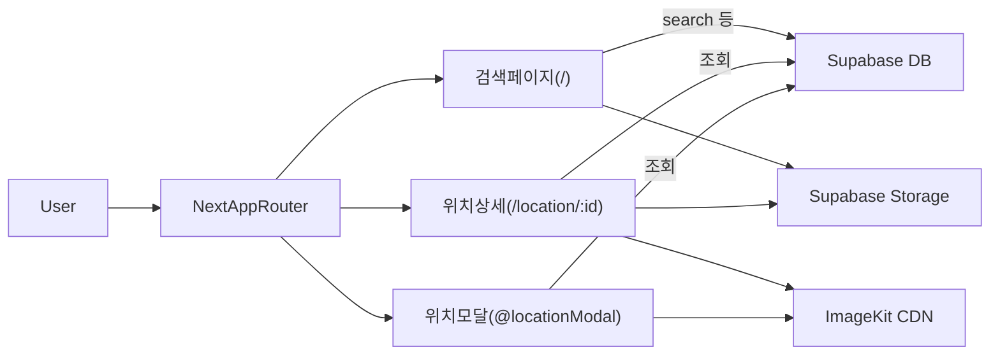
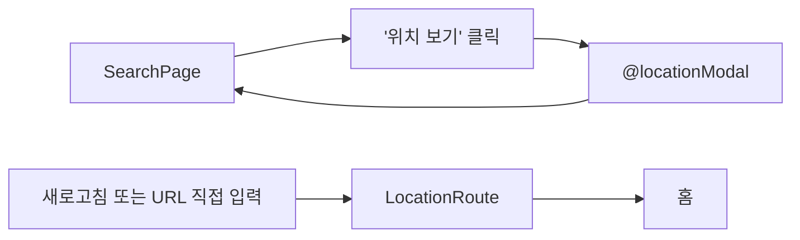

## License

이 프로젝트는 NonCommercial License에 따라 배포됩니다. 비상업적 용도로만 사용 가능합니다.

---

## 프로젝트 개요

> **승룡이네집 도서 검색 시스템 – 만화카페 책 위치를 바로 찾는 검색 서비스**  
> 강동구 강풀만화거리(승룡이네집)에 있는 만화책들의 위치를, 검색 한 번으로 바로 찾을 수 있는 웹 서비스입니다.

- **문제**: 수백 권의 만화책이 있지만, 원하는 책의 **위치(책장 번호)** 를 한 번에 알 수 있는 시스템이 없었습니다.
- **해결**: 책 제목 일부만 입력해도 도서를 검색하고, **책장 조감도 이미지와 함께 실제 위치**를 안내하는 검색 시스템을 구축했습니다.

---

# 승룡이네집 도서 검색 시스템


## 1. 배포 URL

[승룡이네집 도서 검색 시스템](https://seongryung.vercel.app/)


## 기술 스택

- **Framework**: Next.js 15 (App Router)
- **Runtime**: React 19
- **Language**: TypeScript
- **UI**: Tailwind CSS, 커스텀 컬러 테마, `lucide-react`
- **Data & Backend**: Supabase(PostgreSQL), `@supabase/supabase-js` + Server Actions, React `cache()`로 조회 함수 메모이제이션
- **Storage & Media**: Supabase Storage(도서 표지 등), **ImageKit CDN**(고해상도 위치 지도 — `next/image` 커스텀 로더로 `tr` 변환)
- **Infra & 기타**: Vercel 배포, `@vercel/analytics`, `@vercel/speed-insights`

이전 스택(AWS RDS MySQL, AWS S3)에서 Supabase로 이전한 내용은 저장소의 `AWS_to_Supabase_Migration.md` 등을 참고하면 됩니다.

## 주요 기능

- **제목 기반 도서 검색**: `ilike`를 사용한 **부분 일치** 검색으로, 제목에 검색어가 포함된 도서를 조회합니다. 결과 상태는 **`/?query=...` URL Query**로 유지해 새로고침·공유 시에도 동일 결과를 재현합니다.
- **검색 흐름 UX**: 검색 중 로딩 인디케이터, **추천 검색어** 클릭으로 바로 검색, **결과 없음**일 때도 안내 UI로 다음 행동을 제시합니다.
- **`Suspense` + Skeleton**: 검색 결과 영역에 Suspense와 카드 Skeleton을 두어 초기 공백과 레이아웃 점프를 줄였습니다.
- **책장 위치 안내(하드 + 소프트 네비게이션)**  
  - **Hard navigation**: 검색 카드 **위치 보기** → **`/location/:id`** 로 이동(직접 URL·새로고침 포함 시에도 동일 페이지).  
  - **Soft navigation**: 검색 페이지 위에서 **Intercepting Route + Parallel Route(`@locationModal`)** 로 모달 오버레이. 모달에서는 `useLayoutEffect`로 `body` 스크롤 잠금 및 스크롤 위치 복원으로 배경 끌림·CLS를 완화합니다.
- **이미지**: 표지는 Supabase Storage URL을 `next/image`로 표시하고, **첫 8개 카드만 `priority`** 를 줘 초기 렌더 부담을 줄였습니다. **위치 지도**는 ImageKit 경로 + 커스텀 로더(`buildImageKitUrl`)로 폭·품질·`f-auto` 변환을 적용합니다. 풀 상세에서는 상단 표지에 `priority`, 모달에서는 **지도에 `priority`** 를 두어 화면 비중에 맞게 분기했습니다.
- **위치 지도 선요청**: `ToLocationButton`에서 상세·모달에 그려지는 변환 URL과 **동일 규칙**인 `getLocationMapPreloadUrl`로 `new Image()` 선요청을 걸어, **`onMouseEnter`** 및 터치 대응 **`onPointerDown`** 으로 전환 전에 네트워크를 엽니다( `docs/location-map-image-preload.md` 참고).
- **SEO**: 검색·도서별 `generateMetadata`와 Open Graph, favicon/OG 이미지 설정.

## 아키텍처

- Next.js App Router + **Server Actions** + **Supabase(PostgreSQL·Storage)** + **ImageKit(위치 지도)** 조합입니다.
- DB·스토리지 접근은 `lib/supabase/server.ts`의 클라이언트를 통해 이루어지며, 검색/도서 조회는 `app/utils/actions.ts`의 Server Action(`search`, `getBookLocation`, `getBookLocationAndBookInfo`, `getBookMetadata` 등)에 모아 두었습니다.


```mermaid
flowchart LR
  user[User]
  nextApp[NextAppRouter]
  searchPage["검색페이지(/)"]
  locationPage["위치상세(/location/:id)"]
  locationModal["위치모달(@locationModal)"]
  db[Supabase DB]
  storage[Supabase Storage]
  imageKit[ImageKit CDN]

  user --> nextApp
  nextApp --> searchPage
  nextApp --> locationPage
  nextApp --> locationModal

  searchPage -->|"search 등"| db
  locationPage -->|"조회"| db
  locationModal -->|"조회"| db

  searchPage --> storage
  locationPage --> storage
  locationPage --> imageKit
  locationModal --> imageKit
```


```mermaid
flowchart LR
  searchPage[SearchPage]
  clickLocation['위치 보기' 클릭]
  softRoute["@locationModal"]
  hardRoute[LocationRoute]
  homePage[홈]
  directUrl[새로고침 또는 URL 직접 입력]

  searchPage --> clickLocation
  clickLocation --> softRoute
  softRoute --> searchPage

  directUrl --> hardRoute
  hardRoute --> homePage
```

## 폴더 구조

```text
app/
  layout.tsx           # 공통 레이아웃, 헤더, Parallel Route 슬롯(locationModal)
  page.tsx             # 검색 인풋 + 결과 리스트, 검색어별 SEO 메타데이터
  location/[id]/page.tsx
                       # hard navigation용 위치 + 도서 상세 페이지
  @locationModal/(.)location/[id]/page.tsx
                       # 검색 페이지 위에 뜨는 모달 위치 안내(soft navigation)

app/components/
  InputBox.tsx         # 검색 인풋 및 검색 실행
  SearchResults.tsx    # 검색 결과 리스트
  BookCard.tsx         # 개별 도서 카드
  BookCardSkeleton.tsx # 로딩 Skeleton UI
  GoBackButton.tsx     # 뒤로가기 버튼

lib/
  supabase/server.ts   # Supabase 서버 클라이언트

app/utils/
  db.ts                # Book 등 공용 타입
  actions.ts           # Server Actions(검색, 도서/위치 조회)
  locationMapImagePreload.ts  # 위치 지도 선요청용 URL(로더와 동일 규칙)
  util.ts, constants.ts 등

imageKitLoader.ts      # next/image 전역 커스텀 로더(ImageKit `tr`)
```

## 역할 및 기여

- **기획·설계·구현·배포를 모두 직접 진행**한 개인 프로젝트입니다.
- **데이터/인프라**: 초기에는 AWS RDS(MySQL) + S3를 사용했고, 이후 **Supabase(PostgreSQL + Storage)** 로 이전해 운영·비용 구조를 단순화했습니다. 고해상도 **위치 지도**는 **ImageKit CDN** 과 `next/image` 커스텀 로더로 전달·최적화합니다.
- **Next.js App Router**: Parallel/Intercepting Route로 soft/hard 네비게이션을 모두 지원하는 위치 UX, `Suspense`/Skeleton, 선요청으로 상세 전환 직후 LCP 공백 완화.
- **SEO/UX**: `generateMetadata`/OG, 검색 결과 `priority` 분기, 모달 스크롤 잠금(`useLayoutEffect`), 반응형 테마 등.

---

## 페이지 시연

### [/]

- 만화책을 제목을 입력하여 검색할 수 있습니다. 최소 한 글자(공백 제외) 이상이어야 검색 가능합니다.
- 추천 검색어(강풀 작가님의 책으로 임의 구성) 클릭을 통해서도 검색할 수 있습니다.
- 도서 검색 가이드로 원하는 책을 찾기 쉽도록 합니다.


### [/?query=검색어]

- 검색 상태는 `useState`가 아니라 **`?query=`** 로 두어, 새로고침·URL 공유 시에도 같은 결과를 봅니다.
- `ilike` 기반 부분 매칭이며, 결과가 없을 때도 안내 카드로 검색 흐름을 이어 줍니다.
- 각 책 카드의 **위치 보기**는 **`/location/:id`** 로의 링크(Hard navigation)이며, 검색 페이지 위에서는 같은 경로를 가로채 **모달(Soft navigation)** 으로도 열립니다.
- 도서 규모에 맞춰 페이지네이션·무한 스크롤은 두지 않았습니다.


### [/location/:id]

- 책 위치와 메타 정보를 보여 주는 페이지이며, **Hard navigation**(직접 URL·새로고침)과 **Soft navigation**(검색 화면 위 모달)을 모두 지원합니다.

- **Soft navigation**  
  - 검색 결과에서 **위치 보기**를 누르면 Intercepting + Parallel route로 **모달**이 뜨고, 목록 스크롤은 유지됩니다.  
  - 모달 마운트 시 `useLayoutEffect`로 배경 스크롤을 잠그고 해제 시 스크롤 위치를 복원합니다.  
  - 뒤로 가기 시 검색 페이지로 돌아갑니다.

    

- **Hard navigation**  
  - 새로고침·URL 직접 입력 시 풀 페이지로 열리며, 책 정보와 위치 지도를 함께 표시합니다.  
  - 뒤로 가기 시 홈으로 이동합니다.

    
